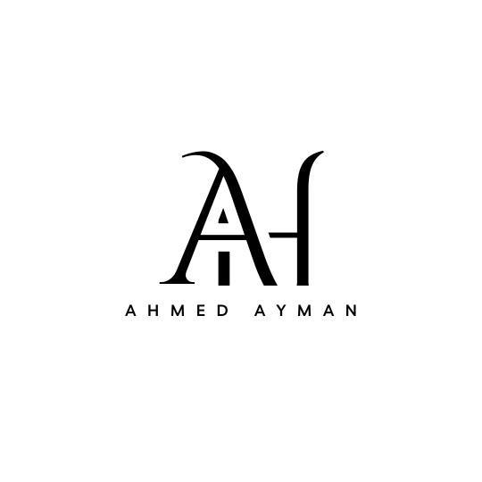
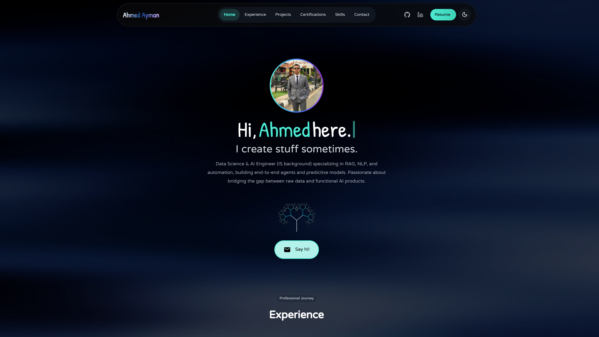

<div align="center">



# Ahmed Ayman's Portfolio

A modern, responsive portfolio built with Next.js and Tailwind CSS.

[Live site](https://ahmedayman.vercel.app/) • [Repository](https://github.com/AhmedAyman4/ahmed-ayman-portfolio) • [LinkedIn](https://www.linkedin.com/in/ahmed-alhofy/) • [Email](mailto:ahmedalhofy42@gmail.com)



</div>

## Tech stack

<p align="left">
  
  
  
  
  
  
  
  
</p>

## Project structure

```
.
├─ src/
│  ├─ app/                  # Next.js App Router routes & pages
│  │  ├─ certificates/      # Certificates page
│  │  ├─ contact/           # Contact page
│  │  ├─ projects/          # Projects page
│  │  ├─ favicon.ico        # Site favicon
│  │  ├─ globals.css        # Global CSS styles
│  │  ├─ layout.tsx         # Main layout definition
│  │  └─ page.tsx           # Hero page entry point
│  ├─ components/           # React UI components
│  │  ├─ ui/                # Shared base UI elements (buttons, inputs, etc.)
│  │  ├─ HeroSection.tsx    # Hero section component
│  │  ├─ Navbar.tsx         # Navigation bar
│  │  ├─ ProjectsComponent.tsx # Project grid and tags
│  │  ├─ SkillsSection.tsx  # Dynamic skills visualizer
│  │  └─ ...                # Other page section components
│  ├─ assets/               # Fonts, icons, and static local assets
│  ├─ hooks/                # Custom React hooks (theme, scrolling)
│  ├─ lib/                  # Utility functions and helper classes
│  └─ styles/               # Component-specific styles and animations
├─ public/                  # Static assets served directly
│  ├─ images/               # Project screenshots and assets
│  ├─ videos/               # Demo videos and background effects
│  └─ Ahmed_Ayman_Alhofy.pdf # Resume PDF
├─ components.json          # Shadcn UI configuration
├─ package.json             # NPM dependencies & scripts
├─ next.config.ts           # Next.js configuration
├─ tailwind.config.ts       # Tailwind CSS design system configuration
└─ tsconfig.json            # TypeScript configuration
```

## Run locally

Prerequisites: Node.js 18+ and npm

```powershell
git clone https://github.com/AhmedAyman4/ahmed-ayman-portfolio.git
cd ahmed-ayman-portfolio
npm install
npm run dev
```

Then open http://localhost:9002

## Scripts

- dev: start the dev server (port 9002)
- build: production build
- start: run the built app
- lint: lint code
- typecheck: TypeScript type checking

## Features

- Responsive layout with dark/light mode
- Smooth animations and interactions
- Project showcase with images and links
- Contact and social links

## Contact

Ahmed Ayman Alhofy — ahmedalhofy42@gmail.com — https://www.linkedin.com/in/ahmed-alhofy/
